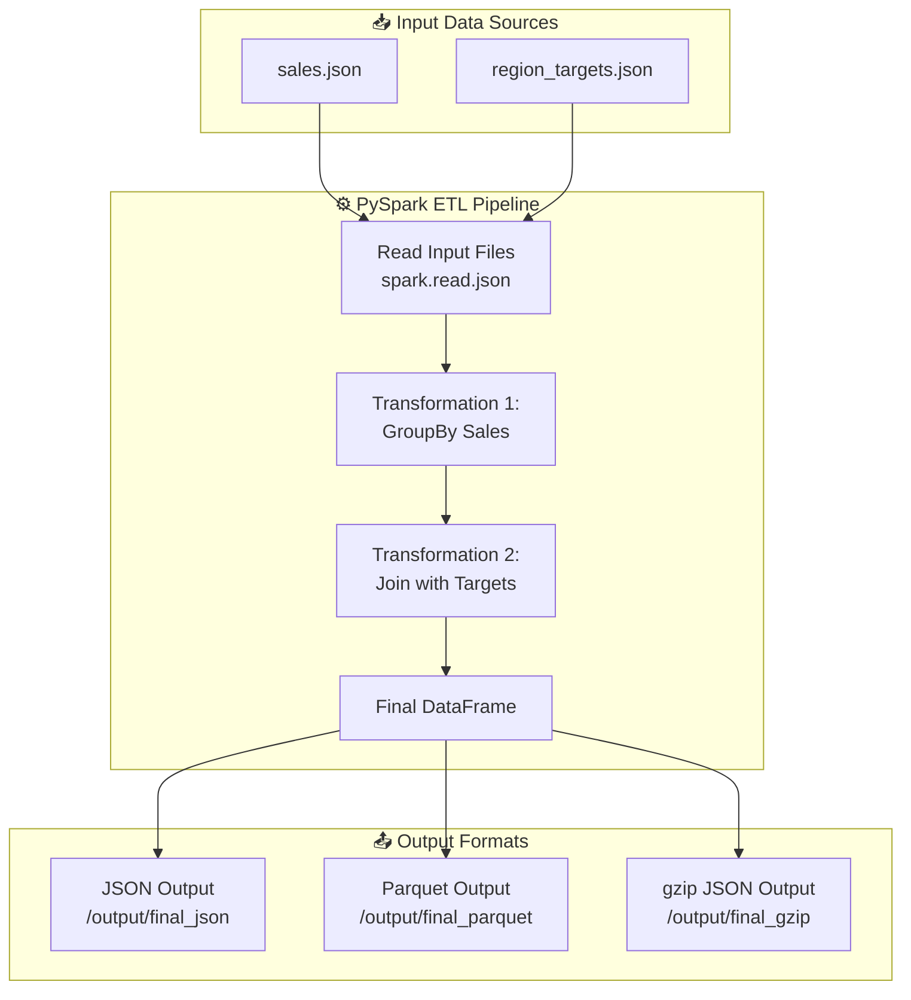

# 📘 Data Pipeline (PySpark) Overview 
A fully functional, scalable ETL data pipeline built using PySpark, supporting:

    - Modular plug-able transformations

    - Multi-format outputs (JSON, Parquet, gzip)

    - Connector-based design (file system, extendable to S3/GCP/SQL)

    - Docker packaging

    - GitHub Actions CI/CD

    - Clean folder structure

    - Easy local + container execution

This matches the typical structure used in production-grade data engineering systems.

# 📂 Project Structure
```bash
data_pipeline/
│
├── data/
│   ├── sales.json
│   └── region_targets.json
│
├── output/                # Auto generated by pipeline
│
├── src/
│   ├── pipeline.py
│   └── transformations/
│       ├── group_by.py
│       └── join_data.py
│
├── Dockerfile
├── requirements.txt
└── README.md
```

# 🧠 Full Data Pipeline Structure



# 🔧 Features

### ✔ Scalable PySpark Pipeline
### ✔ Plug-able Transformations

* GroupBy
* Join

### ✔ Connector-Based Read/Write
Uses file connectors (local filesystem), but paths can easily be swapped to:

* S3
* GCP
* Hadoop
* SQL JDBC

### ✔ Multi Format Outputs

* JSON
* Parquet
* gzip-compressed JSON

### ✔ Dockerized
Fully containerized & environment-agnostic.

### ✔ CI/CD Included
GitHub Actions workflow runs the ETL pipeline automatically.

# 📥 Input Data
`data/sales.json`
```json
[
  {"region": "North", "product": "A", "sales": 100},
  {"region": "South", "product": "A", "sales": 150},
  {"region": "North", "product": "B", "sales": 200},
  {"region": "East", "product": "A", "sales": 120}
]
```

`data/region_targets.json`
```json
[
  {"region": "North", "target": 250},
  {"region": "South", "target": 200},
  {"region": "East", "target": 150}
]
```

# 🧩 Transformations
GroupBy Transformation (`group_by.py`)
```python
from pyspark.sql import functions as F

def group_by_sales(df):
    return df.groupBy("region").agg(F.sum("sales").alias("total_sales"))

Join Transformation (join_data.py)
def join_targets(sales_df, target_df):
    return sales_df.join(target_df, on="region", how="left")
```

# 🐍 Pipeline Execution
`pipeline.py` creates:

* grouped totals
* merged with target table
* exported in 3 formats

Output is stored in:
```bash
output/
    final_json/
    final_parquet/
    final_gzip/
```

# 🖥️  Running Locally
Install dependencies:
```python
pip install -r requirements.txt
```
Run pipeline:
```python
python src/pipeline.py
```

# 🐳  Running with Docker
Build image:
```bash
docker build -t data-pipeline .
```
Run container:
```
docker run data-pipeline
```


Outputs will be created inside container’s `/app/output`.

# 🔁 CI/CD (GitHub Actions)
Workflows Included:

*ETL Pipeline Test*
Automatically:
* installs Java + Python
* installs PySpark
* runs pipeline.py
* lists output directory

*Optional Docker Build & Push*
Builds multi-architecture image
Publishes to Docker Hub (if secrets configured)

# ✨ Extending the Pipeline

You can easily add:
* ✔ new transformations
* ✔ new connectors (S3, SQL, GCS)
* ✔ new output formats
* ✔ scheduling via Airflow
* ✔ logging & monitoring

This structure follows the standard modular ETL architecture used in production.

[](https://github.com/makresh-dev/data_pipeline-ETL-/actions/workflows/docker-build-and-push.yml)    
